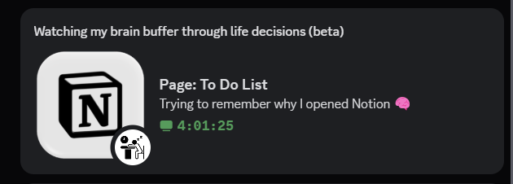
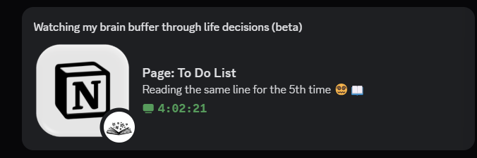
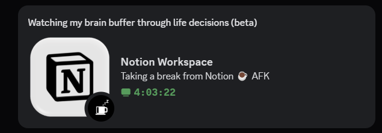

[
&nbsp;

&nbsp;

---

**Notion Discord RPC (beta)** shows your active Notion page, editing mode, reading mode, background mode, and idle state directly on Discord — beautifully, automatically, and instantly.

It works entirely in the background and updates your Discord status based on what you’re doing inside Notion.  
Just open Notion and it works.

These are some of the most notable features:

- Shows the **current Notion page title** (e.g., “Weekly To-Do List”, “Brain Dump”, etc.)
- Detects **editing**, **reading**, **idle**, and **background/unfocused** modes
- Automatically clears your Discord presence when Notion is closed
- Tray icon to restart, open Notion, or exit  
  **⚠️ Restart feature is still unstable when packaged as an EXE**
- Auto-start on Windows (optional)
- No admin permissions required

---

## Download

<!-- DL_BUTTONS_BEGIN -->

%20download/Notion%20Discord%20RPC%20(beta)%201.0.0.exe)

<!-- DL_BUTTONS_END -->

*Only Windows is currently supported. Mac/Linux builds coming soon.*

---

## Features

- **Smart mode detection**  
  Automatically switches between editing → reading → idle → background.

- **Discord Rich Presence**  
  Shows:
  - Current page title  
  - Mode (Editing, Reading, Idle, AFK)  
  - Dynamic timestamps  
  - Notion + activity icons  

- **Tray Menu**
  - Restart RPC *(experimental — may fail on EXE builds)*  
  - Open Notion  
  - Quit  

- **Auto-start on Windows**  
  Starts with your system if enabled.

- **PyInstaller-safe temp folder cleanup**

---

## ⚠️ Known Issues (Important)

### 🔸 Restart feature is unstable on the EXE version  
The `Restart RPC` tray button works perfectly when running:

